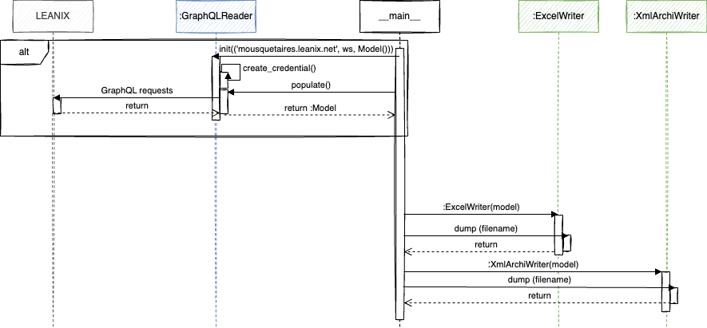

# Export LeanIx content

* Extract Leanix workspace content and convert it to Archimate format OEF ([Open Exchange File](https://www.opengroup.org/open-group-archimate-model-exchange-file-format)). 
* The resulting file is uploaded via SFTP
* A message is send to notify end of process via [ntfy.sh](https://ntfy.sh/)

## Sequence diagram



## Running in Docker container

Assign the configuration variables 

```sh
export LEANIX_WS=my_workspace           # Leanix workspace to export
export LEANIX_URL=mydomain.leanix.net   # Leanix URL
export LEANIX_TOKEN=JustSecret!!        # Leanix token
export SFTP_SRV=sftp_server             # where to upload resulting export
export SFTP_USR=sftp_user               # SFTP user name
export SFTP_PWD=sftp_password           # SFTP password
export NTFY_CHANNEL=topic               # NTFY topic
```

Configure volume directories in docker-compose.yml file

```yaml
version: '3.7'
services:
  leanix2archi:
    build: .
    image: python-converter
    container_name: converter
    environment:
    - TZ=Europe/Paris
    - LEANIX_WS
    - LEANIX_URL
    - LEANIX_TOKEN
    - SFTP_SRV
    - SFTP_USR
    - SFTP_PWD
    - NTFY_CHANNEL
    volumes:
    - /Users/serge/Dev/Volume/leanix2archi/output:/app/output
    - /Users/serge/Dev/Volume/leanix2archi/log:/app/log
    command: [ "python", "leanIxConverter.py"]
```

### Build image

```sh
docker compose build
```

### Launch Docker container

```sh
docker compose up
```

### Output files

* changelog.txt
* leanix2archi-WS-light.xml
* Leanix2excel-WS.xlsx
* warnings-WS.xlsx

## License

See the [LICENSE](LICENSE) file for license rights and limitations (GNU AGPL).